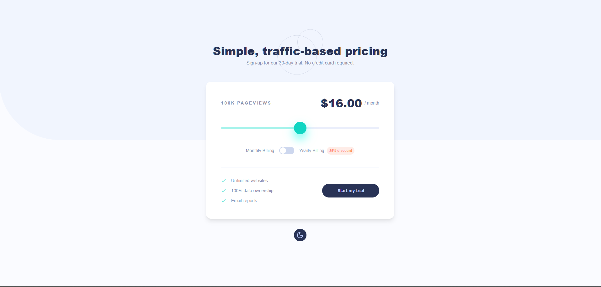
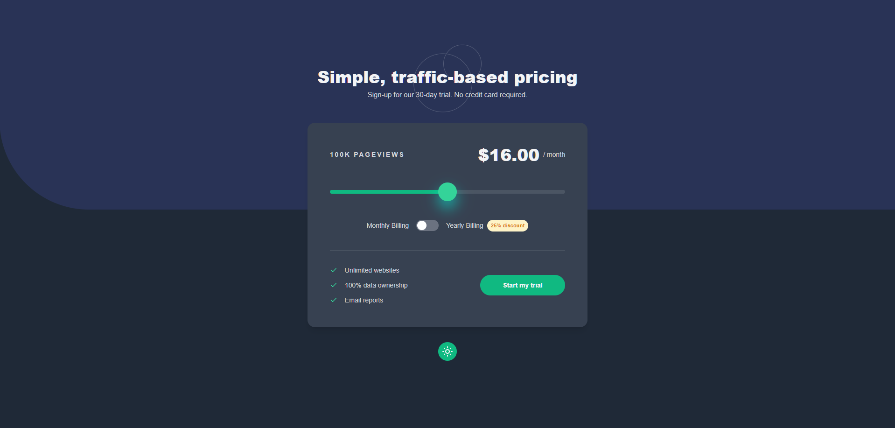
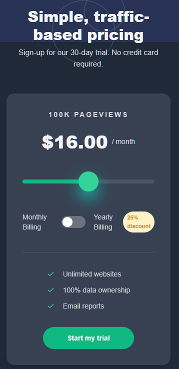

# Frontend Mentor - Interactive pricing component solution

This is a solution to the [Interactive pricing component challenge on Frontend Mentor](https://www.frontendmentor.io/challenges/interactive-pricing-component-t0m8PIyY8). Frontend Mentor challenges help you improve your coding skills by building realistic projects. 

## Table of contents

- [Overview](#overview)
  - [The challenge](#the-challenge)
  - [Screenshot](#screenshot)
  - [Links](#links)
- [My process](#my-process)
  - [Built with](#built-with)

## Overview

### The challenge

Users are able to:

- View the optimal layout for the app depending on their device's screen size
- See hover states for all interactive elements on the page
- Use the slider and toggle to see prices for different page view numbers
- Dark mode toggle

### Screenshot

#### Desktop

#### Mobile

### Links

- Solution URL: [https://github.com/sahilq312/invsto](https://github.com/sahilq312/invsto)
- Live Site URL: [https://invsto-five.vercel.app/](https://invsto-five.vercel.app/)

### Built with

- [React](https://reactjs.org/) - JS library
- [Tailwind CSS](https://tailwindcss.com/) - For styles
- [TypeScript](https://www.typescriptlang.org/) - For types
- [Next.js](https://nextjs.org/) - React framework

